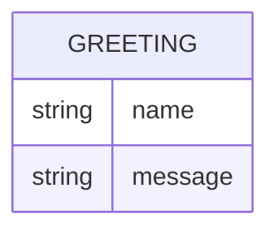

# Domain model

Greeter holds no persisted data (per the requirements' Out of Scope). The only
shape it works with is the greeting it returns.

`GREETING` is not stored; it is the shape of the `GET /hello` response —
`name` is the (optional) input echoed back, `message` is the greeting text.